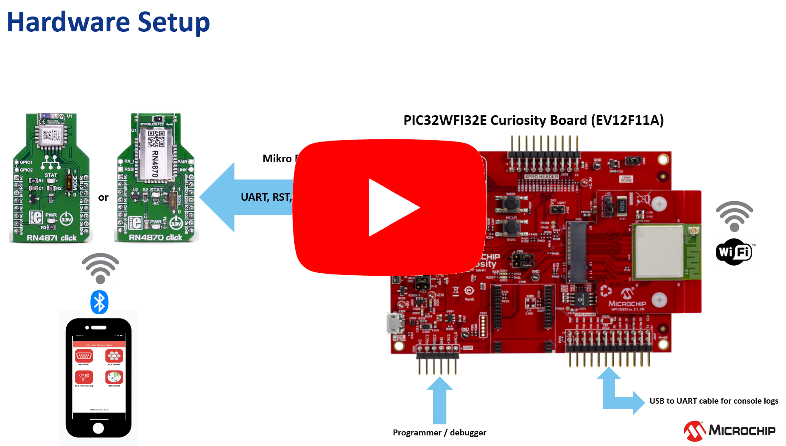
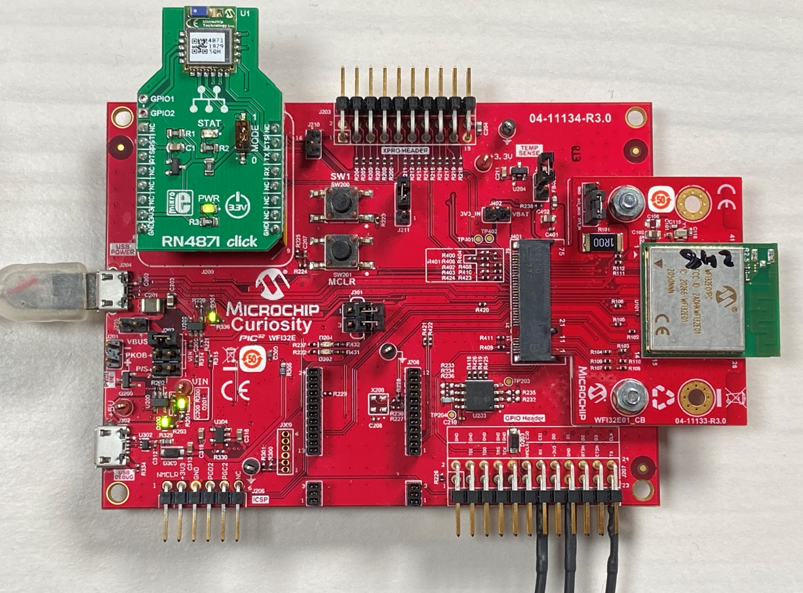
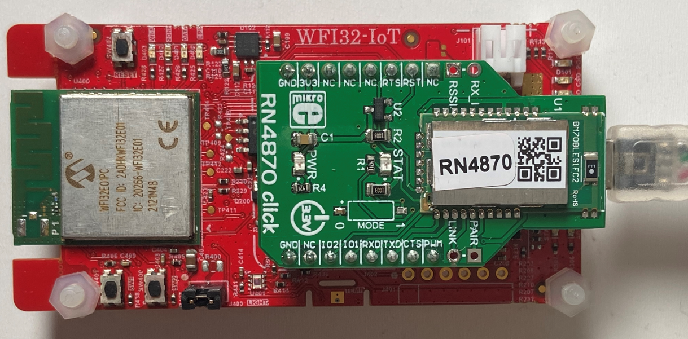
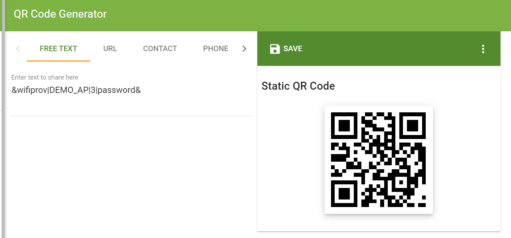
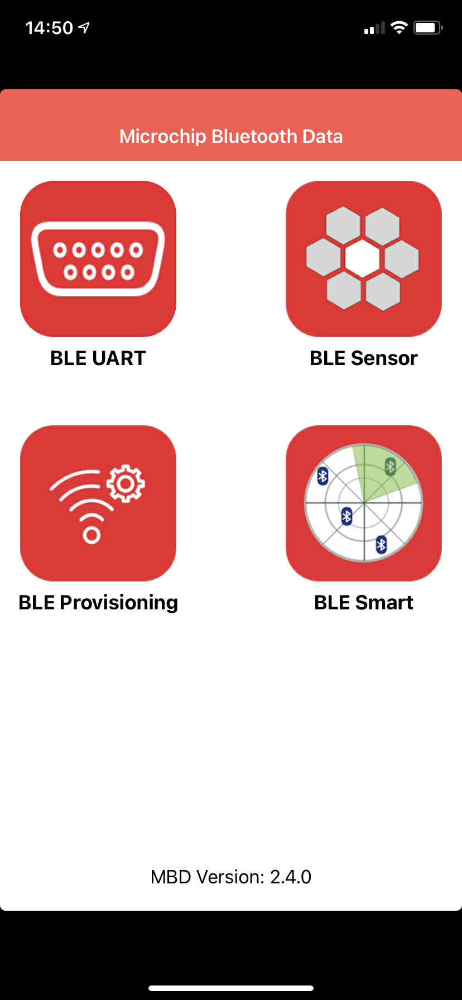
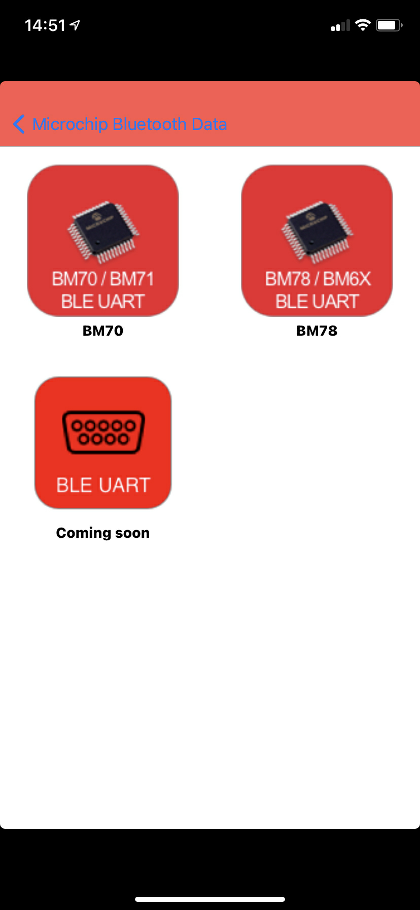
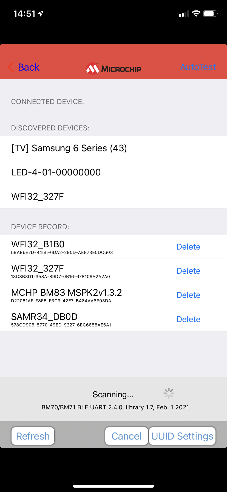
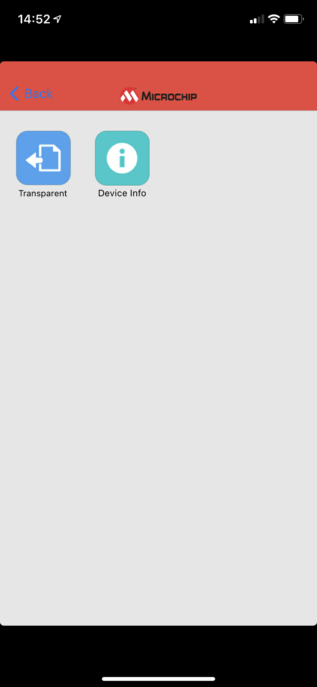
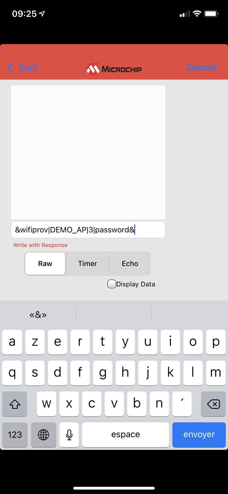
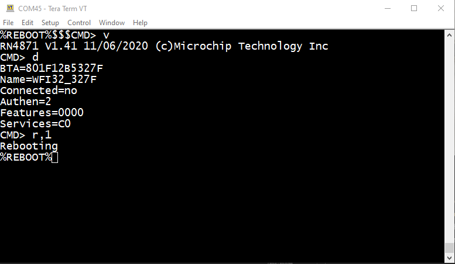

# Enable BLE-WiFi Bridge


> "Wireless Made Easy!" - This example application bridge the BLE link and Wi-Fi to enable Wi-Fi communication and configuration over BLE

Devices: **WFI32E01 | RN4870 | RN4871**

**Watch the video and see how to enable Wi-Fi provisioning over BLE with WFI32E**

<p align="center">
<a href="https://youtu.be/HWui3HDnw80" target="_blank">
</a>
</p>


## ⚠ Disclaimer

<p><span style="color:red"><b>
THE SOFTWARE ARE PROVIDED "AS IS" AND GIVE A PATH FOR SELF-SUPPORT AND SELF-MAINTENANCE.</br></br>
This repository contains unsupported example code intended to help accelerate client product development. It is not validated for production nor audited for security best-practices.</br></br>
Note that while this repository is unsupported, Microchip welcome community contributions, and all pull-requests will be considered for inclusion into the repository.
</span></p></b>

> Interact with peers in the community at [WiFi Forum](https://www.microchip.com/forums/f545.aspx).


### Software requirement

The sample project has been created and tested with the following Software Development Tools:
- MPLAB X IDE v6.00
- MPLAB XC32 v3.01
- MPLAB Harmony v3.6.4
   - mhc v3.8.2
   - csp v3.10.0
   - core v3.10.0
   - wireless_wifi v3.6.1
   - dev_packs v3.10.0
   - wireless_system_pic32mzw1_wfi32e01 v3.6.1
   - wolfssl v4.7.0
   - net v3.7.4
   - crypto v3.7.5
   - CMSIS-FreeRTOS v10.3.1


## Hardware setup using the WFI32 Curiosity Board

- Computer connected to WFI32 Curiositiy board over USB POWER (J204)
- J202 = VBUS
- J301 = open

USB-to-UART cable between the computer and GPIO Header UART1 pins (Rx, GND, Tx) to observe the console logs.

Attach a [RN4871 click](https://www.mikroe.com/rn4871-click) or [RN4870 click](https://www.mikroe.com/rn4870-click) to mikro BUS Header.

<p align="center">

</p>

The WFI32 module is controlling the RN487x BLE module over UART2 (U2RX, U2TX) and one GPIO (BLE_RST line).

| PIC32MZW1 Pin | WFI32 Pin | Pin ID | Function |
| ------------- | --------- | ------ | -------- |
| A56  | 48 | RB9 | U2RX |
| B20  | 28 | RK7 | U2TX |
| B47  | 46 | RB6 | BLE_RST (GPIO, OUT, HIGH) |

## Hardware setup using the WFI32-IoT Board

- Computer connected to WFI32-IoT board over USB POWER (J200)

Attach a [RN4871 click](https://www.mikroe.com/rn4871-click) or [RN4870 click](https://www.mikroe.com/rn4870-click) to mikro BUS Header.

<p align="center">

</p>


## Generate QR code for Wi-Fi provisioning

A QR code is used in the demo to provision the Wi-Fi configuration over BLE.

To be recognized by the `BLE_PROVISIONING` sample application, the QR code must contains a string of characters which respect the following format:

**Frame Format:** `&wifiprov|<ssid>|<authtype>|<password>&`

Where `&` is used to indicate the start and the end of the frame.

`wifiprov` is required and used as a command keyword.

`|` is required and used as a separator.

`<ssid>` is the name of the router / network.

`authtype` represents the security type:
- 1: OPEN mode
- 3: WPAWPA2 (Mixed) mode
- 4: WPA2 mode
- 5: WPA2WPA3 (Mixed) mode
- 6: WPA3 mode

`password` is not required in Open mode

**e.g.:** `&wifiprov|DEMO_AP|3|password&`

Create your own QR code from: [https://www.the-qrcode-generator.com/](https://www.the-qrcode-generator.com/)

<p align="center">

</p>

## Try Wi-Fi over BLE

- Clone/download the repo
- Open the `bleprov` project with MPLAB X IDE
- Build and program the code
- Open Tera Term to observe console logs
- Application starts in AP mode
```
TCP/IP Stack: Initialization Started
TCP/IP Stack: Initialization Ended - success

 mode=1 (0-STA,1-AP) saveConfig=1

 AP Configuration :
 channel=1
 ssidVisibility=1
 ssid=DEMO_AP_SOFTAP
 passphase=password
 authentication type=4 (1-Open,2-WEP,3-Mixed mode(WPA/WPA2),4-WPA2,5-Mixed mode(WPA2/WPA3),6-WPA3)
PIC32MZW1 AP Mode IP Address: 192.168.1.1
[APP_BLE] Init.
[APP_BLE] Configuration done.
Open Microchip Bluetooth Data App
- Select BLE UART and BM70
- Connect to your device WFI32_xxxx
- Select Transparent
- Frame format for Wi-Fi provisioning over BLE:
&wifiprov|<ssid>|<authtype>|<password>&
1: Open, 3: WPAWPA2, 4: WPA2, 5: WPA2WPA3, 6: WPA3
e.g. &wifiprov|DEMO_AP|3|password&
```
- Scan the QR code from the smartphone
- Copy your own Wi-Fi provisioning frame
- Open Microchip Bluetooth Data App
- Select BLE UART then BM70
<p align="center">


</p>

- Connect and select your WFI32_xxxx device
```
[APP_BLE] Connected
```
- Select Transparent option
```
[APP_BLE] Transparent stream opened
```

<p align="center">


</p>

- Paste (or enter the data manually) and send the Wi-Fi provisioning frame

<p align="center">

</p>

- Application restarts in STA mode using the new Wi-Fi configuration
- Application gets and IP address from the network

```
[APP_BLE] Frame received
SSID: DEMO_AP - AUTH: 3 - PASS: password
Wi-Fi Configuration done.ðTCP/IP Stack: Initialization Started
TCP/IP Stack: Initialization Ended - success

 mode=0 (0-STA,1-AP) saveConfig=1

 STA Configuration :
 channel=0
 autoConnect=1
 ssid=DEMO_AP
 passphase=password
 authentication type=3 (1-Open,2-WEP,3-Mixed mode(WPA/WPA2),4-WPA2,5-Mixed mode(WPA2/WPA3),6-WPA3)
[APP_BLE] Init.
[APP_BLE] Configuration done.
Open Microchip Bluetooth Data App
- Select BLE UART and BM70
- Connect to your device WFI32_xxxx
- Select Transparent
- Frame format for Wi-Fi provisioning over BLE:
&wifiprov|<ssid>|<authtype>|<password>&
1: Open, 3: WPAWPA2, 4: WPA2, 5: WPA2WPA3, 6: WPA3
e.g. &wifiprov|DEMO_AP|3|password&
 Trying to connect to SSID : DEMO_AP
 STA Connection failed.

 Trying to connect to SSID : DEMO_AP
 STA Connection failed.

IP address obtained = 192.168.1.149
Gateway IP address = 192.168.1.1
```

## Try BLE Serial Bridge

1. Clone/download the repo
1. Open the `blebridge` project with MPLAB X IDE
1. Build and program the code
1. Communicate with the BLE module from the UART console using ASCII commands described in [RN4870-71 User Guide](https://ww1.microchip.com/downloads/en/DeviceDoc/RN4870-71-Bluetooth-Low-Energy-Module-User-Guide-DS50002466C.pdf)

<p align="center">

</p>